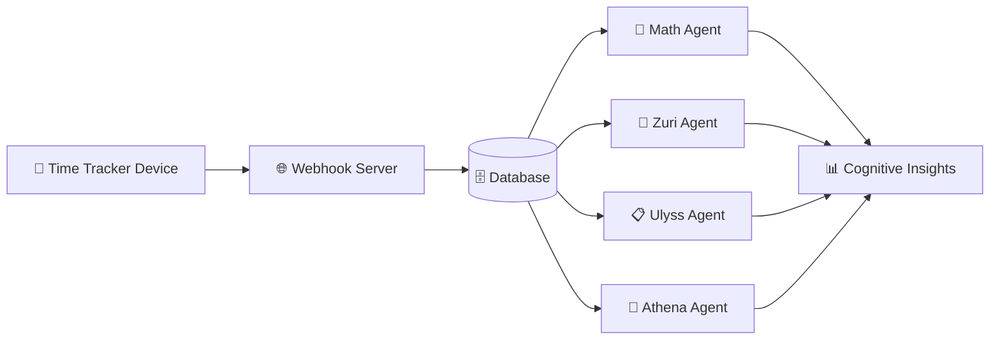

# Time Tracker Device - Cognitive Wealth Ecosystem

Physical edge device that captures work sessions via RFID tags and feeds the cognitive wealth analysis system for personal growth insights.

## 🏗️ **Ecosystem Architecture**



**This Repository:** The edge device (📱) that captures RFID tag events and transforms human activity into structured data for cognitive analysis.

## 🎯 **Device Capabilities**

### **Effortless Time Tracking**
- **Touch & Go:** Place RFID tag → automatic session start
- **Visual Feedback:** LED patterns show system status and session state
- **Offline Resilience:** Stores events locally, syncs when connected
- **Zero Maintenance:** Runs 24/7, handles network changes automatically

### **Flow State Support**
- **Non-Intrusive:** Tracks without disrupting work flow
- **Ultradian Rhythm Awareness:** Gentle visual cues at 60/90 minute intervals
- **Session Confidence:** Visual confirmation of successful tracking
- **Mindful Transitions:** Breathing patterns encourage natural break timing

### **Professional Hardware**
- **Custom PCB:** Production-ready design with artistic silkscreen
- **3D Printed Enclosure:** Durable case with textured finish
- **ESP32-C3:** Modern microcontroller with WiFi and Bluetooth
- **RC522 RFID:** Reliable tag detection with debounce logic
- **WS2812 LED:** Programmable RGB feedback with breathing patterns

## 🔧 **Quick Start**

### **Hardware Setup**
1. **Power:** Connect via USB-C cable
2. **WiFi:** Device creates `TimeTracker-AP` hotspot
3. **Configuration:** Connect to hotspot, browse to `192.168.4.1`
4. **Tags:** Use any 13.56MHz RFID tags (cards, stickers, key fobs)

### **Basic Operation**
1. **Ready State:** Blue breathing LED indicates system ready
2. **Start Session:** Place tag → green flash → solid green (session active)
3. **End Session:** Remove tag → green flash → blue breathing (session saved)
4. **Data Sync:** Events automatically sync to cognitive analysis system

### **Advanced Features**
- **Multiple WiFi Networks:** Automatically connects to strongest known network
- **Flow Awareness:** Orange breathing at 60min, orange pulsing at 90min
- **Grace Period:** 5-second startup delay prevents false positives after reboot
- **Configuration Portal:** Web interface for WiFi and webhook settings

## 🏗️ **For Developers**

### **Architecture & Development**
- **Process Maps:** See `docs/constitution/process_maps/` for complete system behavior diagrams
- **Architecture Authority:** See `CLAUDE.md` for development context and command usage
- **Current Status:** Use `/.claude/commands/phase_status` for latest development state
- **Ecosystem Context:** See `docs/ecosystem/` for integration specifications

### **Constitutional Architecture with Smart Contracts**

🏛️ **IMPORTANT**: Our "smart contracts" are **NOT blockchain-based**. They are constitutional validation contracts that enforce architectural integrity.

#### Constitutional Smart Contracts = Process Map Authority + Automated Validation

```
HOST (main.c)           →  Docker-like orchestrator
├── CONTAINERS (tools)  →  Isolated, event-driven tools  
└── CONTRACTS (process) →  Smart contract validation
```

**Constitutional Tool Architecture:**
```
🎯 main.c (Constitutional HOST)
├── 🔧 rfid_tool        → Container: Tag detection with process map 07
├── 🔧 network_tool     → Container: WiFi management with ESP_EVENT only
├── 🔧 ntp_tool         → Container: Time sync with constitutional timing
├── 🔧 fs_tool          → Container: File operations with handle-based pattern
├── 🔧 payload_tool     → Container: Event formatting with process map 13
├── 🔧 http_tool        → Container: HTTP communication with process map 14
└── 🔧 feedback_tool    → Container: LED feedback with process map 11
```

#### Smart Contract Types:
- **Container Contracts**: Validate tool isolation (zero coupling)
- **Communication Contracts**: Enforce ESP_EVENT-only patterns
- **Process Contracts**: Validate FSM state transitions per process maps
- **Memory Contracts**: Enforce safety patterns (snprintf, handle-based)

#### Constitutional Requirements:
- **Zero Coupling**: Tools communicate only via ESP_EVENT
- **Handle-Based**: No static globals, context in handles
- **Process Map Authority**: FSM diagrams are executable validation rules
- **Constitutional Gates**: Automated compliance checkpoints

### **Build Environment**
- **Platform:** ESP-IDF with PlatformIO integration
- **IDE:** VSCode with PlatformIO extension
- **Commands:** See `/.claude/commands/` for development workflow
- **Documentation:** SPR-compressed technical knowledge in `docs/architecture/`

## 📊 **Technical Specifications**

### **Hardware Requirements**
- **Microcontroller:** ESP32-C3 (WiFi + Bluetooth)
- **RFID Reader:** RC522 module (13.56MHz)
- **Visual Feedback:** WS2812B addressable LED
- **Storage:** 4MB flash with LittleFS file system
- **Connectivity:** WiFi 802.11 b/g/n, USB-C for power

### **Event Data Format**
```json
{
  "event": "tag_placed|tag_removed",
  "tag_uid": "04B78FB0790000",
  "device_id": "ESP32_F0F5BD", 
  "timestamp": "2025-01-15T10:30:45Z",
  "internal_millis": 123456,
  "ntp_offset_ms": 1642234245000
}
```

### **Performance Metrics**
- **Event Accuracy:** >99.5% valid events
- **Timing Precision:** <1 second timestamp error  
- **Battery Life:** N/A (USB powered)
- **Connectivity:** Auto-reconnection with exponential backoff

## 🌱 **Cognitive Wealth Philosophy**

This device embodies principles of **technology that enhances human potential**:

### **Human-Centered Design**
- **Minimal Friction:** Effortless interaction preserves mental energy for meaningful work
- **Flow Respect:** Visual cues support natural work rhythms without interruption
- **Trust Building:** Reliable operation builds confidence in the tracking system
- **Growth Focus:** Data serves personal development, not productivity surveillance

### **Sustainable Practices**
- **Offline-First:** Continues working without internet dependency
- **Energy Efficient:** Low power consumption with intelligent sleep modes
- **Durable Hardware:** Built for years of daily use
- **Open Architecture:** Repairable and expandable design

### **Privacy & Autonomy**
- **Local Processing:** Core functionality works without cloud dependency
- **User Control:** Full access to generated data and settings
- **Transparent Operation:** Open source firmware with clear behavior
- **Data Ownership:** Users retain complete control of their information

## 🚀 **Project Status**

### **Current State**
- ✅ **Hardware:** Production-ready custom PCB and enclosure
- ✅ **Firmware:** Stable operation with full feature set
- ✅ **Architecture:** Clean MCP-inspired tool-based design
- ✅ **Documentation:** Complete process maps and development workflow
- 🔄 **Integration:** Preparing webhook server and agent system

### **Recent Achievements**
- **Generation 3 Hardware:** Custom PCB with artistic design
- **MCP Architecture:** Reusable tool-based component system
- **Process Maps:** Complete behavioral documentation for reliable development
- **Flow Awareness:** 60/90 minute ultradian rhythm support
- **Production Ready:** Stable operation with comprehensive error handling

### **Next Steps**
- **Webhook Server:** Data gateway for ecosystem integration
- **Agent Integration:** AI analysis system for cognitive insights
- **Dashboard Interface:** User-facing insights and recommendations
- **Multi-Device Support:** Ecosystem expansion and coordination

## 📚 **Documentation Structure**

```
README.md                    → This file (ecosystem discovery)
CLAUDE.md                    → Development context for AI collaboration
docs/ecosystem/              → Complete system architecture
docs/constitution/process_maps/ → Process maps (design authority)
docs/architecture/           → Technical patterns (SPR compressed)
docs/project/                → Current development status
.claude/commands/            → Development workflow automation
```

## 🤝 **Contributing**

This project uses a unique **human-AI collaboration workflow** with:
- **Process maps** as architectural authority
- **SPR compression** for knowledge management
- **Custom commands** for session continuity
- **Ecosystem awareness** for integration planning

See `CLAUDE.md` and `docs/constitution/process_maps/` for the complete development approach.

## 📄 **License**

[License information to be added]

---

**Vision:** Technology that respects human nature while amplifying cognitive potential through mindful tracking and AI-powered insights.
