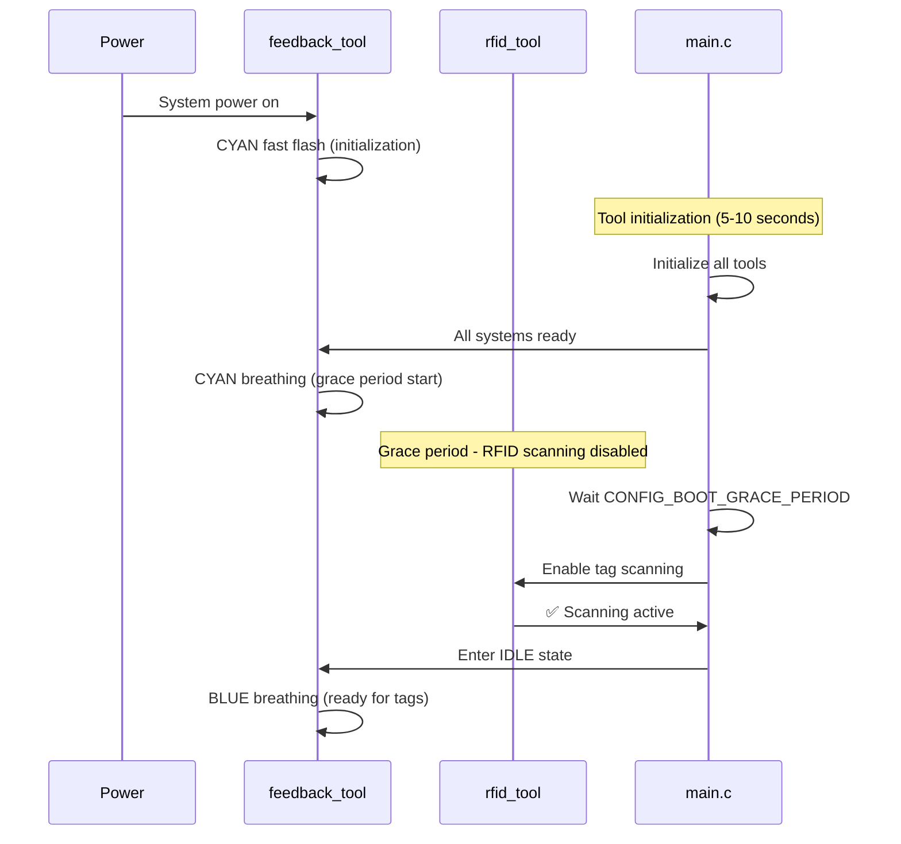

# Time Tracker Color Map v3.0 - Refined UX-Focused Design

## **Core UX Philosophy**

**Cognitive Wealth Companion Device** - Supporting human flow states and system confidence through intentional visual feedback.

**Multi-Persona Design:**
- 👨‍💻 **Developer/Power User:** System health and debugging information
- 👤 **User:** Session confidence and system readiness  
- 🧘 **Flow Practitioner:** Mindful awareness without interruption

---

## **Core Color Language**

### **Primary States**
- **🔵 BLUE:** System readiness and communication health
- **🟢 GREEN:** Active session states and confirmations
- **🟠 ORANGE:** Flow awareness and mindful transitions (60/90min ultradian rhythm)
- **🔴 RED:** Errors requiring attention
- **🟡 YELLOW:** Warnings and configuration issues
- **🟣 PURPLE:** AP mode and configuration portal active
- **🩵 CYAN:** System initialization and startup processes

### **Pattern Language**
- **SOLID:** Stable state
- **BREATHING:** Gentle awareness (3-4 second cycles)
- **PULSING:** Clear attention invitation (1-2 second cycles)
- **FLASHING:** Processing or urgent attention (sub-second)

---

## **Complete State Implementation**

### **🩵 Initialization & Boot**
```
CYAN FLASHING → System starting up
├─ Fast cyan blinks during tool initialization
├─ Indicates "something is happening, not an error"
├─ Prevents user confusion during 5-10 second boot
└─ Transitions to IDLE when all systems ready
```

**Grace Period Logic:**
- **5-second RFID silence** after boot completion
- Prevents false positives from pre-existing tags
- CYAN breathing during grace period
- Visual cue: "System starting, please wait before placing tags"

### **🔵 IDLE State (System Ready)**
```
BLUE BREATHING → All systems ready
├─ NTP synced (no 1970 timestamp risk)
├─ WiFi connected and stable
├─ Webhook endpoint confirmed reachable  
├─ RFID module initialized and scanning
└─ Breathing cycle: 3 seconds (inhale/exhale feel)
```

**Variants:**
- **Blue breathing with GREEN tints:** Pending data queued for sync
- **Blue solid:** Brief transition state

### **🟢 Active Session States**
```
Session Flow:
BLUE BREATHING → GREEN FLASH → GREEN SOLID → BLUE BREATHING
     ↑              ↑             ↑             ↑
   Ready        Processing    Confirmed      Session End
```

**Detailed States:**
- **GREEN FLASH (300ms):** Tag detected, creating payload
- **GREEN SOLID:** Session confirmed by server, actively tracking
- **GREEN FLASH (300ms):** Tag removed, ending session
- **Return to BLUE BREATHING:** Session complete, back to ready

### **🟠 Flow Awareness (Ultradian Rhythm Support)**
```
Active Session Progression:
0-60min:  GREEN SOLID (normal tracking)
60-90min: ORANGE BREATHING (gentle awareness invitation)  
90min+:   ORANGE PULSING (clear transition suggestion)
```

**Flow State Logic:**
- **60min:** Gentle orange breathing (mindfulness anchor, no urgency)
- **90min:** Clear orange pulsing (transition invitation, still gentle)
- **Breathing pattern:** 5-second cycle mimicking 4-7-8 ratio (calm, meditative)
- **Philosophy:** Support flow, don't interrupt it

### **🔴 Error States**
```
CRITICAL ERRORS (Override all other states):
├─ RED FAST FLASH: Hardware failure (RFID, LED, etc.)
├─ RED SLOW PULSE: Network/HTTP persistent failure  
├─ RED SOLID: System requires restart
└─ RED + Serial monitor for detailed diagnostics
```

**Error Philosophy:** Simple red patterns + detailed logging for developers

### **🟡 Warning States**
```
NON-CRITICAL WARNINGS:
├─ YELLOW FLASH: Temporary network issue, retrying
├─ YELLOW BREATHING: Configuration issue (webhook URL, etc.)
└─ YELLOW SOLID: Attention needed but system functional
```

### **🟣 AP Mode & Configuration**
```
PURPLE BREATHING → Configuration portal active
├─ WiFi AP "TimeTracker-Setup" broadcasting
├─ Web interface available at 192.168.4.1
├─ Clear visual cue for configuration readiness
└─ Continues until WiFi credentials successfully saved
```

---

## **Smart State Priority System**

### **Hierarchy (Single LED Conflict Resolution)**
```
1. 🔴 CRITICAL ERRORS     → Override everything
2. 🩵 INITIALIZATION      → Override normal operations
3. 🟣 AP MODE            → Override operational states
4. 🟠 FLOW AWARENESS     → During active sessions only
5. 🟢 SESSION STATES     → Normal operation
6. 🔵 IDLE BREATHING     → Baseline ready state
7. 🟡 WARNINGS           → Background, non-disruptive
```

### **Conflict Resolution Examples**
- **Error during flow state:** Red overrides orange
- **AP mode during session:** Purple overrides green, session data preserved
- **Warning during idle:** Yellow blends with blue (brief interruption)

---

## **Optimized Configuration**

### **Essential Timing Parameters (5 core values)**
```c
// Core UX timing
CONFIG_IDLE_BREATHING_CYCLE      = 3000ms    // Blue ready breathing
CONFIG_SESSION_FLASH_DURATION    = 300ms     // Green confirmation flash
CONFIG_FLOW_AWARENESS_60MIN      = 3600000ms // First mindfulness cue
CONFIG_FLOW_AWARENESS_90MIN      = 5400000ms // Transition invitation  
CONFIG_BOOT_GRACE_PERIOD         = 5000ms    // Post-boot RFID delay

// Derived timing (automatic ratios)
CONFIG_ORANGE_BREATHING_CYCLE    = 5000ms    // 4:7:8 breathing feel
CONFIG_ORANGE_PULSING_CYCLE      = 1500ms    // Clear attention pulse
CONFIG_AP_MODE_CYCLE            = 2000ms    // Purple breathing
CONFIG_INIT_FLASH_INTERVAL      = 200ms     // Cyan startup flashes
```

---

## **Technical Implementation Notes**

### **Boot Sequence with Grace Period**


### **Timestamp Optimization Strategy**
```c
// Use internal clock + NTP offset for immediate timestamps
typedef struct {
    uint32_t internal_millis;    // ESP32 internal clock
    int32_t ntp_offset_ms;       // Calculated offset to real time
    bool ntp_synced;            // Confidence flag
} timestamp_context_t;

// Generate timestamp immediately on RFID event
time_t get_event_timestamp(uint32_t event_millis) {
    if (ntp_synced) {
        return (event_millis + ntp_offset_ms) / 1000;
    } else {
        // Use internal time with warning flag
        return event_millis / 1000;  // Will be corrected later
    }
}
```

### **False Positive Prevention**
```c
// Boot grace period implementation
typedef struct {
    bool grace_period_active;
    uint32_t grace_end_time;
    bool initial_tag_present;
} boot_context_t;

void handle_boot_grace_period(void) {
    // Check if tag present during grace period
    if (grace_period_active && rfid_tag_present()) {
        initial_tag_present = true;
        feedback_show_state(GRACE_PERIOD_TAG_DETECTED);
        // Continue breathing cyan, don't start session
    }
    
    // Grace period complete
    if (time_now > grace_end_time) {
        grace_period_active = false;
        if (initial_tag_present) {
            // Tag was there during boot - start fresh session now
            feedback_show_state(SESSION_STARTED);
        } else {
            feedback_show_state(IDLE);
        }
    }
}
```

---

## **UX Validation Scenarios**

### **Scenario 1: Normal Operation**
```
User Experience:
1. Device boots → CYAN flashing (5s) → CYAN breathing (5s grace) → BLUE breathing
2. "System ready, all green lights"
3. Place tag → GREEN flash → GREEN solid
4. "Session confirmed, tracking active"  
5. Remove tag → GREEN flash → BLUE breathing
6. "Session ended, ready for next"
```

### **Scenario 2: Reboot During Session**
```
Problem: Tag already present when device reboots
Solution:
1. Device boots → CYAN flashing → CYAN breathing (grace period)
2. RFID detects existing tag during grace period
3. System waits until grace period complete  
4. Then treats as fresh session start
5. No false "tag removed" event
```

### **Scenario 3: Flow Awareness**
```
Deep Work Session:
1. Start session → GREEN solid (normal tracking)
2. 60 minutes → ORANGE breathing (gentle awareness)
3. User continues working (respects flow state)
4. 90 minutes → ORANGE pulsing (clearer transition cue)
5. User chooses when to take break
6. Remove tag → Session ends normally
```

### **Scenario 4: Network Issues**
```
Offline Operation:
1. WiFi fails during session → YELLOW flash (warning)
2. Session continues → GREEN solid (local tracking)
3. Data queued → BLUE breathing with GREEN tints (when idle)
4. WiFi restored → Automatic sync → Pure BLUE breathing
5. "System recovered gracefully"
```

---

## **Future Enhancement Pathways**

### **Dual LED Option**
- **Primary LED:** System states (current design)
- **Secondary LED:** Dedicated flow awareness
- **Benefit:** Simultaneous system status + flow state

### **Adaptive Flow Timing**
- **Learn user patterns:** Adjust 60/90min timers based on actual break patterns
- **Circadian integration:** Different timing for morning vs afternoon
- **Personal calibration:** Individual flow state optimization

### **Advanced Configuration**
- **Per-user profiles:** Different color preferences
- **Workspace modes:** Office vs home different patterns  
- **Accessibility options:** High contrast, longer durations

---

## **Design Philosophy Summary**

1. **Intentional UX:** Every color and pattern serves a specific user need
2. **Flow-Respectful:** Technology that supports human rhythms, doesn't interrupt them
3. **Confidence-Building:** Visual confirmation prevents user uncertainty  
4. **Progressive Disclosure:** Simple baseline with power-user depth available
5. **Graceful Degradation:** System continues functioning even when components fail

**Bottom Line:** This isn't just a time tracker - it's a **Cognitive Wealth companion** that understands human flow states and supports intentional work practices.

---

*Refined based on UX-focused feedback and technical optimization insights* ✨
