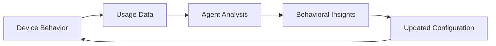
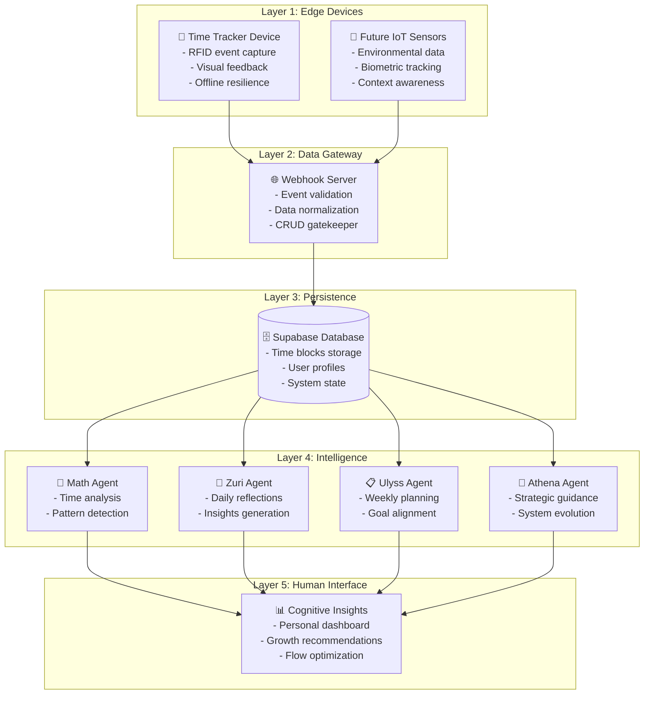

# Device Role in Cognitive Wealth Ecosystem

## 🎯 **Device Position & Purpose**

The Time Tracker Device serves as the **primary data collection point** in the cognitive wealth ecosystem - the crucial first layer that transforms passive work into trackable, analyzable data for cognitive development.

## 🔗 **Ecosystem Integration Role**

### **As Data Producer**
```
Human Activity → Device Sensors → Structured Events → Ecosystem Intelligence
     ↑              ↑                  ↑                    ↑
  Flow State    RFID Tags         JSON Payloads      Cognitive Insights
```

### **As User Interface**
```
System Status → Visual Feedback → Human Understanding → Behavior Adjustment
     ↑              ↑                     ↑                    ↑
  Internal State  LED Patterns        Confidence         Flow Optimization
```

## 📊 **Data Contribution to Ecosystem**

### **Primary Data Types**
- **Session Events:** Start/stop times with precise timestamps
- **Tag Identification:** Project/context categorization
- **Duration Tracking:** Automatic session length calculation
- **Flow Patterns:** Ultradian rhythm detection (60/90min cycles)
- **System Health:** Device status and connectivity metrics

### **Data Quality Assurance**
- **Timestamp Accuracy:** NTP sync + internal clock compensation
- **Event Validation:** Debounce logic prevents false positives
- **Offline Resilience:** Local storage ensures no data loss
- **Error Detection:** Grace periods prevent reboot artifacts

### **Data Format Standardization**
```json
{
  "event_type": "tag_placed|tag_removed",
  "tag_uid": "unique_identifier",
  "device_id": "esp32_mac_address",
  "timestamp": "ISO8601_utc",
  "metadata": {
    "internal_millis": "device_uptime_ms",
    "ntp_offset_ms": "time_correction",
    "ntp_synced": "boolean",
    "boot_counter": "device_restart_tracking",
    "firmware_version": "semantic_version",
    "wifi_network": "connection_context",
    "signal_strength": "connectivity_quality"
  }
}
```

## 🧠 **Intelligence Enablement**

### **For Math Agent**
- **Precise timing data** for statistical analysis
- **Session patterns** for productivity insights
- **Context switching** detection and optimization
- **Focus duration** metrics and trends

### **For Zuri Agent** 
- **Daily activity summaries** for reflection generation
- **Project allocation** for goal alignment assessment
- **Energy patterns** for optimal scheduling suggestions
- **Work rhythms** for personalized insights

### **For Ulyss Agent**
- **Weekly patterns** for strategic planning
- **Goal progress** tracking across projects
- **Habit formation** data for behavior optimization
- **Context effectiveness** analysis

### **For Athena Agent**
- **Long-term trends** for strategic guidance
- **System usage patterns** for evolution recommendations
- **User behavior insights** for system improvements
- **Cross-temporal analysis** for growth strategies

## 🎮 **User Experience Contribution**

### **Immediate Feedback Loop**
```
Action → Device Response → User Confidence → Continued Usage
  ↑           ↑                ↑                ↑
Tag Scan   LED Pattern    System Trust    Data Quality
```

### **Flow State Support**
- **Non-intrusive tracking** maintains focus
- **Visual flow cues** (60/90min breathing patterns)
- **Session confidence** prevents workflow anxiety
- **Effortless operation** reduces cognitive overhead

### **Behavior Shaping**
- **Positive reinforcement** through visual feedback
- **Habit formation** via consistent interaction patterns
- **Awareness building** without interruption
- **Trust establishment** through reliability

## 🔄 **Bi-directional Intelligence**

### **Device → Ecosystem (Data Upload)**
- Raw events and sensor data
- System health and performance metrics
- User interaction patterns
- Environmental context (network, timing)

### **Ecosystem → Device (Configuration Download)**
- **Dynamic settings** based on usage patterns
- **Flow timing adjustments** (60/90min personalization)
- **Visual feedback optimization** (colors, patterns)
- **System tuning** for individual preferences

### **Learning Loop**


## 🚀 **Ecosystem Multiplication Effects**

### **Network Effects**
- **Multiple devices** per user (home, office, mobile)
- **Consistent experience** across locations
- **Data aggregation** for comprehensive insights
- **Cross-device coordination** for seamless workflows

### **Intelligence Amplification**
- **Rich data** enables sophisticated analysis
- **Real-time feedback** improves user engagement
- **Pattern recognition** across user base (anonymized)
- **Continuous improvement** of recommendations

### **Scalability Enablement**
- **Standard protocols** allow ecosystem expansion
- **Modular design** supports diverse sensor types
- **Edge processing** reduces server load
- **Offline capability** ensures reliability

## 🎯 **Success Metrics**

### **Data Quality Metrics**
- **Event accuracy:** >99.5% valid events
- **Timing precision:** <1 second timestamp error
- **Uptime reliability:** >99% operational availability
- **Sync efficiency:** <30 second offline-to-sync delay

### **User Engagement Metrics**
- **Daily usage:** Consistent interaction patterns
- **Session duration:** Meaningful work periods captured
- **Flow detection:** 60/90min pattern recognition
- **Trust indicators:** Sustained long-term usage

### **Ecosystem Integration Metrics**
- **Data throughput:** Events per minute processing
- **Agent utilization:** How intelligence consumes device data
- **Insight generation:** Device data → actionable recommendations
- **System evolution:** Configuration improvements over time

## 🔮 **Future Device Capabilities**

### **Enhanced Sensing**
- **Environmental data** (light, sound, air quality)
- **Biometric integration** (heart rate, stress levels)
- **Context awareness** (calendar, location)
- **Multi-modal input** (voice, gesture, proximity)

### **Intelligent Edge Processing**
- **Local pattern recognition** for immediate feedback
- **Predictive modeling** for flow state optimization
- **Privacy-preserving** analysis at device level
- **Reduced latency** for real-time insights

### **Ecosystem Coordination**
- **Device-to-device** communication for context
- **Distributed intelligence** across edge network
- **Collaborative filtering** for recommendation improvement
- **Federated learning** for privacy-preserving insights

---

**Bottom Line:** The device transforms human activity into ecosystem intelligence while providing immediate value through visual feedback and flow state support. It's both a data producer and user interface that enables the entire cognitive wealth system.
# Ecosystem Integration Points

## 🔗 **Interface Specifications**

This document defines the exact integration requirements between the Time Tracker Device and the broader Cognitive Wealth ecosystem.

## 📡 **Device → Webhook Server Interface**

### **HTTP Endpoint Requirements**
```
POST /api/v1/time-events
Content-Type: application/json
Authorization: Bearer {device_token}
```

### **Standard Event Payload**
```json
{
  "event_type": "tag_placed|tag_removed",
  "tag_uid": "04B78FB0790000",
  "device_id": "ESP32_F0F5BD",
  "timestamp": "2025-01-15T10:30:45.123Z",
  "metadata": {
    "internal_millis": 123456789,
    "ntp_offset_ms": 1642234245000,
    "ntp_synced": true,
    "boot_counter": 42,
    "wifi_network": "WorkNetwork_5G",
    "signal_strength": -45,
    "firmware_version": "v3.1.2"
  }
}
```

### **Response Format**
```json
{
  "status": "success|error",
  "event_id": "uuid_v4",
  "timestamp_received": "2025-01-15T10:30:45.456Z",
  "validation": {
    "timestamp_valid": true,
    "device_authorized": true,
    "event_format_valid": true
  },
  "config_updates": {
    "flow_timing": {
      "awareness_60min": 3600000,
      "urgency_90min": 5400000
    },
    "visual_feedback": {
      "idle_breathing_cycle": 3000,
      "session_flash_duration": 300
    }
  }
}
```

### **Error Responses**
```json
{
  "status": "error",
  "error_code": "INVALID_TIMESTAMP|DEVICE_NOT_FOUND|MALFORMED_PAYLOAD",
  "message": "Human readable error description",
  "retry_after": 30,
  "support_reference": "error_ref_uuid"
}
```

## 🌐 **Webhook Server Architecture**

### **Server Role (fs_tool Pattern)**
```
Device Events → Validation → Normalization → Database Storage
     ↓              ↓            ↓               ↓
Rate Limiting   Auth Check   Data Cleanup   Persistence
```

### **Key Responsibilities**
- **Event Validation:** Timestamp, format, device authorization
- **Data Normalization:** Consistent timezone, format standardization
- **Rate Limiting:** Prevent spam, handle burst events
- **Authentication:** Device registration and token management
- **Database Gatekeeper:** Only component with direct DB write access
- **Configuration Management:** Dynamic device settings updates

### **Expected Server Capabilities**
```
REQUIRED ENDPOINTS:
├─ POST /api/v1/time-events        → Primary event ingestion
├─ GET  /api/v1/device/config     → Configuration retrieval
├─ POST /api/v1/device/register   → New device registration  
├─ GET  /api/v1/device/status     → Health check endpoint
└─ POST /api/v1/device/heartbeat  → Keep-alive mechanism
```

## 🗄️ **Database Schema Requirements**

### **Time Events Table**
```sql
CREATE TABLE time_events (
  id UUID PRIMARY KEY DEFAULT uuid_generate_v4(),
  device_id VARCHAR(32) NOT NULL,
  event_type VARCHAR(16) NOT NULL, -- 'tag_placed', 'tag_removed'
  tag_uid VARCHAR(32) NOT NULL,
  timestamp_utc TIMESTAMPTZ NOT NULL,
  internal_millis BIGINT,
  ntp_offset_ms BIGINT,
  ntp_synced BOOLEAN,
  boot_counter INTEGER,
  wifi_network VARCHAR(64),
  signal_strength INTEGER,
  firmware_version VARCHAR(16),
  received_at TIMESTAMPTZ DEFAULT NOW(),
  processed BOOLEAN DEFAULT FALSE,
  
  -- Indexes for performance
  INDEX idx_device_timestamp (device_id, timestamp_utc),
  INDEX idx_tag_events (tag_uid, event_type, timestamp_utc),
  INDEX idx_processing (processed, received_at)
);
```

### **Device Registry Table**
```sql
CREATE TABLE devices (
  device_id VARCHAR(32) PRIMARY KEY,
  device_name VARCHAR(64),
  mac_address VARCHAR(18) UNIQUE,
  first_seen TIMESTAMPTZ DEFAULT NOW(),
  last_heartbeat TIMESTAMPTZ,
  firmware_version VARCHAR(16),
  hardware_revision VARCHAR(16),
  location VARCHAR(64),
  user_id UUID REFERENCES users(id),
  active BOOLEAN DEFAULT TRUE,
  configuration JSONB
);
```

### **Processed Sessions Table** (Created by agents)
```sql
CREATE TABLE work_sessions (
  id UUID PRIMARY KEY DEFAULT uuid_generate_v4(),
  device_id VARCHAR(32) REFERENCES devices(device_id),
  tag_uid VARCHAR(32),
  start_event_id UUID REFERENCES time_events(id),
  end_event_id UUID REFERENCES time_events(id),
  start_time TIMESTAMPTZ,
  end_time TIMESTAMPTZ,
  duration_seconds INTEGER,
  project_name VARCHAR(128),
  session_type VARCHAR(32),
  created_at TIMESTAMPTZ DEFAULT NOW(),
  
  INDEX idx_user_sessions (device_id, start_time),
  INDEX idx_project_analysis (project_name, start_time)
);
```

## 🤖 **Database → AI Agents Interface**

### **Agent Data Access Pattern**
```
Database (Read-Only) → A2A Task Queue → Agent Processing → Memory Blocks
     ↓                      ↓               ↓              ↓
Raw Events          Task Coordination   Analysis      Knowledge Storage
```

### **Math Agent Data Requirements**
```sql
-- Time analysis queries
SELECT 
  device_id,
  DATE(timestamp_utc) as date,
  tag_uid,
  COUNT(*) as event_count,
  SUM(duration_seconds) as total_time
FROM work_sessions 
WHERE start_time >= '2025-01-01'
GROUP BY device_id, date, tag_uid;
```

### **Zuri Agent Data Requirements**
```sql
-- Daily reflection data  
SELECT 
  device_id,
  DATE(start_time) as work_date,
  ARRAY_AGG(project_name) as projects,
  SUM(duration_seconds) as total_focus_time,
  COUNT(DISTINCT tag_uid) as context_switches,
  MIN(start_time) as first_session,
  MAX(end_time) as last_session
FROM work_sessions
WHERE start_time >= CURRENT_DATE - INTERVAL '1 day'
GROUP BY device_id, work_date;
```

### **Agent Memory Integration**
```
Time Events → Session Processing → Agent Analysis → Memory Blocks → Templates
     ↓              ↓                  ↓              ↓            ↓
Device Data    Structured Data    Insights      Knowledge    Evolution
```

## 🔄 **Configuration Management**

### **Device Configuration Schema**
```json
{
  "device_id": "ESP32_F0F5BD",
  "config_version": "1.2.3",
  "last_updated": "2025-01-15T10:30:45Z",
  "settings": {
    "flow_awareness": {
      "enabled": true,
      "awareness_60min_ms": 3600000,
      "urgency_90min_ms": 5400000,
      "breathing_cycle_ms": 5000,
      "pulsing_cycle_ms": 1500
    },
    "visual_feedback": {
      "idle_breathing_cycle_ms": 3000,
      "session_flash_duration_ms": 300,
      "brightness_level": 128,
      "color_theme": "default"
    },
    "connectivity": {
      "heartbeat_interval_s": 300,
      "retry_backoff_base_ms": 1000,
      "max_retry_attempts": 8,
      "offline_queue_size": 100
    },
    "debugging": {
      "verbose_logging": false,
      "serial_output": true,
      "led_debug_mode": false
    }
  }
}
```

### **Dynamic Configuration Updates**
```
Agent Analysis → Template Evolution → Configuration Updates → Device Sync
      ↓                ↓                     ↓                ↓
User Patterns    Optimized Settings    Server Storage    Runtime Apply
```

## 🔍 **Monitoring & Health**

### **Device Health Metrics**
```json
{
  "device_id": "ESP32_F0F5BD",
  "timestamp": "2025-01-15T10:30:45Z",
  "system": {
    "uptime_ms": 86400000,
    "free_heap": 45632,
    "wifi_signal": -45,
    "ntp_synced": true,
    "boot_counter": 42
  },
  "performance": {
    "events_per_hour": 12,
    "avg_response_time_ms": 150,
    "sync_success_rate": 98.5,
    "buffer_utilization": 15
  },
  "errors": {
    "rfid_read_errors": 0,
    "network_timeouts": 2,
    "ntp_sync_failures": 0,
    "storage_errors": 0
  }
}
```

### **Ecosystem Health Dashboard**
```
Device Status → Server Metrics → Database Performance → Agent Activity
     ↓              ↓                  ↓                  ↓
Connectivity   Processing Rate    Query Performance   Insight Generation
```

## 🚀 **Integration Testing Strategy**

### **Device-Server Integration Tests**
- **Event delivery** under normal conditions
- **Offline resilience** with network failures
- **Retry logic** with server unavailability
- **Configuration updates** with dynamic settings
- **Error handling** with malformed data

### **Server-Database Integration Tests**
- **Data validation** and normalization
- **Performance** under load conditions
- **Transaction integrity** during failures
- **Query optimization** for agent access

### **End-to-End Ecosystem Tests**
- **Device event** → **Agent insight** complete flow
- **Configuration change** → **Device behavior** validation
- **Multi-device** coordination and data aggregation
- **Long-term** pattern recognition and evolution

## 🔮 **Future Integration Points**

### **Enhanced Device Capabilities**
- **Biometric sensors** integration
- **Environmental data** collection
- **Context awareness** (calendar, location)
- **Voice interaction** for manual logging

### **Advanced Analytics Integration**
- **Real-time** pattern recognition
- **Predictive modeling** for optimization
- **Cross-user insights** (anonymized)
- **Recommendation engines** for flow improvement

### **External System Integration**
- **Calendar systems** for automatic context
- **Project management** tools for goal tracking
- **Health platforms** for holistic optimization
- **Productivity suites** for workflow integration

---

**Integration Philosophy:** Loose coupling with strong contracts - each layer can evolve independently while maintaining reliable communication through well-defined interfaces.
# Cognitive Wealth Ecosystem Overview

## 🎯 **Complete System Architecture**

The Time Tracker Device is **Layer 1** of a five-layer cognitive wealth ecosystem designed to transform passive time tracking into active cognitive development.

## 🏗️ **Matryoshka Architecture**



## 🔄 **Data Flow Patterns**

### **Edge → Gateway (fs_tool Pattern)**
```
Device Tools → Event Buffer → Webhook Tool → Server
     ↓
Local Storage ← ← ← Retry Logic ← ← ← Network Failure
```

**Key Insight:** Device `fs_tool` and webhook server follow **identical patterns** - both are data gatekeepers with CRUD permissions and retry logic.

### **Gateway → Intelligence (A2A Pattern)**
```
Webhook Server → Database → A2A Task Queue → Agents
      ↓              ↓            ↓           ↓
   Validation   Persistence  Coordination  Analysis
```

### **Intelligence → Human (Insight Synthesis)**
```
Multiple Agents → Memory Blocks → Insight Engine → Dashboard
       ↓              ↓              ↓           ↓
   Specialized    Knowledge      Synthesis   Action
   Analysis      Aggregation   Processing  Guidance
```

## 🎯 **Layer Responsibilities**

### **Layer 1: Edge Devices (This Repository)**
- **Physical interaction** with human workflow
- **Event capture** with high reliability
- **Offline resilience** and sync capabilities
- **Visual feedback** for user confidence
- **Flow awareness** (ultradian rhythm support)

### **Layer 2: Webhook Server**
- **Data validation** and normalization
- **Event routing** to appropriate storage
- **CRUD gatekeeper** for database
- **Retry handling** for failed operations
- **Security** and authentication

### **Layer 3: Database (Supabase)**
- **Persistent storage** of all events
- **User profile management**
- **System state tracking**
- **Query optimization** for agent access

### **Layer 4: AI Agents**
- **Math Agent:** Quantitative analysis, patterns, metrics
- **Zuri Agent:** Qualitative insights, daily reflections
- **Ulyss Agent:** Weekly planning, goal alignment
- **Athena Agent:** Strategic guidance, system evolution

### **Layer 5: Human Interface**
- **Personal dashboard** with cognitive insights
- **Growth recommendations** based on patterns
- **Flow optimization** suggestions
- **System feedback** for continuous improvement

## 🔗 **Integration Points**

### **Device → Server Interface**
```json
// Standard event format
{
  "event": "tag_placed",
  "tag_uid": "04B78FB0790000",
  "device_id": "ESP32_F0F5BD", 
  "timestamp": "2025-01-15T10:30:45Z",
  "internal_millis": 123456,
  "ntp_offset_ms": 1642234245000
}
```

### **Server → Database Interface**
- **Time blocks** table with normalized events
- **Device registry** for ecosystem management
- **User sessions** with calculated durations
- **System logs** for debugging and analytics

### **Database → Agents Interface**
- **A2A protocol** for task coordination
- **Memory blocks** with isotope decay
- **Template evolution** based on usage patterns
- **Feedback loops** for system improvement

## 🚀 **Ecosystem Benefits**

### **Scalability**
- **Add new devices** without changing server logic
- **Add new agents** without affecting existing analysis
- **Horizontal scaling** at each layer independently

### **Reliability** 
- **Offline-first** edge devices continue working
- **Retry mechanisms** at each integration point
- **Graceful degradation** when components fail

### **Intelligence Evolution**
- **Agent templates** evolve based on user patterns
- **System learns** optimal configurations automatically
- **Feedback loops** improve accuracy over time

### **Human-Centered Design**
- **Minimal friction** for data capture
- **Meaningful insights** not just raw data
- **Flow-respectful** notifications and guidance
- **Personal growth** focus over productivity optimization

## 🔮 **Future Expansion**

### **New Device Types**
- **Environmental sensors** (light, noise, air quality)
- **Biometric trackers** (heart rate, stress indicators)
- **Context sensors** (location, calendar integration)

### **Advanced Intelligence**
- **Cross-user pattern analysis** (anonymized)
- **Predictive modeling** for optimal work patterns
- **Personalized coaching** based on individual data

### **Integration Capabilities**
- **Calendar systems** for automatic context
- **Project management** tools for goal alignment
- **Health platforms** for holistic optimization

---

**Philosophy:** Technology that enhances human cognitive capacity while respecting natural rhythms and individual autonomy.
