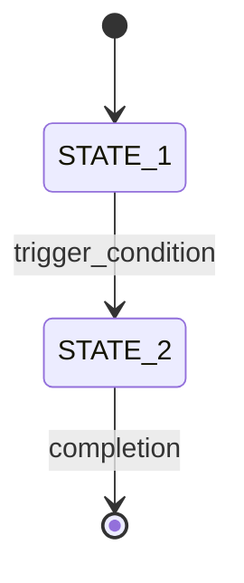

# Process Maps - Constitutional Authority

## Overview

These process maps serve as **constitutional documents** for the Time Tracker Device. They define the fundamental system behavior and must be followed exactly during implementation.

## ⚖️ Constitutional Authority

**CRITICAL:** Process maps are **constitutional authority** - they define system behavior that cannot be modified during implementation phases.

### Authority Rules
1. **NEVER modify** during implementation phases
2. **ALWAYS follow** exact sequences shown
3. **VALIDATE changes** against maps before implementing
4. **UPDATE only** during architectural reviews with full ecosystem impact assessment

## 📋 Current Process Maps

### **Master System Behavior**
- **`01_device_master_fsm.mmd`** - Complete device state machine with esp_event hub
  - Tool initialization and health checking (5-second timeout)
  - ESP event system as central communication backbone
  - System monitor coordination and dashboard management
  - Network management and AP mode behavior

### **Hardware Interface Layer**
- **`07_tag_detection_fsm.mmd`** - RFID tag detection lifecycle
  - 5-second boot grace period (mute events)
  - 100ms polling with 200ms debounce confirmation
  - Tag appearance/disappearance state management
  
- **`08_tag_event_fsm.mmd`** - Event processing and formatting
  - Event payload creation with uptime timestamps
  - ESP event posting to system
  - Retry logic on formatting failures

### **System Management**
- **`11_feedback_fsm.mmd`** - Visual feedback state management
  - System state to LED pattern mapping
  - Recipe execution without decision logic
  - State-driven visual feedback coordination

### **Data Processing**
- **`13_payload_fsm.mmd`** - Payload creation with dependencies
  - NTP sync validation before processing
  - Real timestamp calculation from uptime + NTP offset
  - Device metadata inclusion (ID, health, version)
  - Separate storage and HTTP transmission triggers

- **`14_http_fsm.mmd`** - HTTP communication and retry logic
  - Exponential backoff retry strategy (1s, 2s, 4s, 8s, 16s)
  - Local storage fallback on max retries
  - WiFi status checking before transmission

## 🏗️ Architecture Patterns

### ESP Event Hub Pattern
All process maps follow the **centralized esp_event system** pattern:
```
Tool A → esp_event → Tool B
Tool C → esp_event → Tool D
```

**No direct tool-to-tool communication** - all coordination through esp_event publish/subscribe.

### Async State Machines
Each FSM operates **asynchronously** with clear state transitions:
- Event-driven state changes
- No blocking operations in state transitions
- Clear error handling and recovery paths

### Tool Boundaries
Each process map respects **tool responsibility boundaries**:
- Single responsibility per tool
- Clear input/output contracts
- No shared global state
- Handle-based tool interactions

## 🔄 Integration with Development

### Using `/map_check` Command
Before making any architectural changes:
```bash
/map_check "tool_name" "proposed_change"
```

This validates:
- Sequence compliance with relevant process maps
- Tool boundary respect
- State machine compatibility
- Ecosystem integration impact

### Process Map Compliance
All code changes must:
1. Follow exact sequences shown in diagrams
2. Respect state machine boundaries
3. Maintain tool responsibility separation
4. Preserve error handling patterns

## 🌐 Ecosystem Integration

These process maps are designed for **ecosystem compatibility**:

### Data Format Consistency
- JSON payload formats match agent expectations
- Timestamp precision supports statistical analysis
- Error codes enable ecosystem debugging

### Communication Patterns
- HTTP retry logic ensures reliable data delivery
- Event formats support webhook server validation
- State reporting enables system health monitoring

### Future Expansion
- Process maps support multi-device coordination
- State machines allow for additional sensors
- Communication patterns scale to webhook server architecture

## 📊 Process Map Reading Guide

### Mermaid Diagram Format


### Common Symbols
- **`[*]`** - Start/end states
- **`→`** - State transitions
- **`<<choice>>`** - Decision points
- **`{}`** - Grouped states
- **Notes** - Implementation details

### Color Coding (when present)
- **Blue/Aqua** - Normal operation states
- **Red** - Error states
- **Yellow** - Warning states
- **Green** - Success states

## 🔧 Implementation Guidelines

### State Machine Implementation
```c
// Example FSM structure following process maps
typedef enum {
    FSM_STATE_INIT,
    FSM_STATE_ACTIVE,
    FSM_STATE_ERROR
} fsm_state_t;

typedef struct {
    fsm_state_t current_state;
    // State-specific data
} fsm_context_t;

esp_err_t fsm_handle_event(fsm_context_t* ctx, event_t event) {
    // Follow exact state transitions from process map
    switch (ctx->current_state) {
        case FSM_STATE_INIT:
            // Handle per process map sequence
            break;
        // ... other states
    }
}
```

### Event System Usage
```c
// Publishing events (as shown in process maps)
esp_event_post(EVENT_BASE, EVENT_ID, &data, sizeof(data), 0);

// Subscribing to events (tool coordination)
esp_event_handler_register(EVENT_BASE, EVENT_ID, handler_function, context);
```

## 🚨 Critical Dependencies

### Time-Critical Sequences
- **5-second grace period** must be enforced exactly
- **200ms debounce** timing is critical for reliability
- **Exponential backoff** timing prevents server overload

### Tool Initialization Order
Boot sequence must follow `01_device_master_fsm.mmd` exactly:
1. ESP event system initialization
2. Tool registration with health check
3. 5-second timeout for tool responses
4. System monitor activation
5. Grace period coordination

### Error Handling Patterns
All FSMs must implement consistent error handling:
- Error state transitions clearly defined
- Recovery mechanisms preserve system stability
- Error reporting through esp_event system

---

## 📚 Related Documentation

- **`docs/constitution/tool_charter.md`** - Tool boundaries and responsibilities
- **`docs/constitution/ecosystem_contract.md`** - Integration specifications
- **`/.claude/commands/map_check.md`** - Validation command usage
- **`CLAUDE.md`** - Development context and authority

---

**Remember:** These process maps are the **constitutional foundation** of the system. They ensure reliable operation, maintainable architecture, and seamless ecosystem integration.
