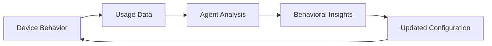

# Device Role in Cognitive Wealth Ecosystem

## 🎯 **Device Position & Purpose**

The Time Tracker Device serves as the **primary data collection point** in the cognitive wealth ecosystem - the crucial first layer that transforms passive work into trackable, analyzable data for cognitive development.

## 🔗 **Ecosystem Integration Role**

### **As Data Producer**
```
Human Activity → Device Sensors → Structured Events → Ecosystem Intelligence
     ↑              ↑                  ↑                    ↑
  Flow State    RFID Tags         JSON Payloads      Cognitive Insights
```

### **As User Interface**
```
System Status → Visual Feedback → Human Understanding → Behavior Adjustment
     ↑              ↑                     ↑                    ↑
  Internal State  LED Patterns        Confidence         Flow Optimization
```

## 📊 **Data Contribution to Ecosystem**

### **Primary Data Types**
- **Session Events:** Start/stop times with precise timestamps
- **Tag Identification:** Project/context categorization
- **Duration Tracking:** Automatic session length calculation
- **Flow Patterns:** Ultradian rhythm detection (60/90min cycles)
- **System Health:** Device status and connectivity metrics

### **Data Quality Assurance**
- **Timestamp Accuracy:** NTP sync + internal clock compensation
- **Event Validation:** Debounce logic prevents false positives
- **Offline Resilience:** Local storage ensures no data loss
- **Error Detection:** Grace periods prevent reboot artifacts

### **Data Format Standardization**
```json
{
  "event_type": "tag_placed|tag_removed",
  "tag_uid": "unique_identifier",
  "device_id": "esp32_mac_address",
  "timestamp": "ISO8601_utc",
  "internal_millis": "device_uptime_ms",
  "ntp_offset_ms": "time_correction",
  "session_metadata": {
    "boot_counter": "device_restart_tracking",
    "wifi_network": "connection_context",
    "signal_strength": "connectivity_quality"
  }
}
```

## 🧠 **Intelligence Enablement**

### **For Math Agent**
- **Precise timing data** for statistical analysis
- **Session patterns** for productivity insights
- **Context switching** detection and optimization
- **Focus duration** metrics and trends

### **For Zuri Agent** 
- **Daily activity summaries** for reflection generation
- **Project allocation** for goal alignment assessment
- **Energy patterns** for optimal scheduling suggestions
- **Work rhythms** for personalized insights

### **For Ulyss Agent**
- **Weekly patterns** for strategic planning
- **Goal progress** tracking across projects
- **Habit formation** data for behavior optimization
- **Context effectiveness** analysis

### **For Athena Agent**
- **Long-term trends** for strategic guidance
- **System usage patterns** for evolution recommendations
- **User behavior insights** for system improvements
- **Cross-temporal analysis** for growth strategies

## 🎮 **User Experience Contribution**

### **Immediate Feedback Loop**
```
Action → Device Response → User Confidence → Continued Usage
  ↑           ↑                ↑                ↑
Tag Scan   LED Pattern    System Trust    Data Quality
```

### **Flow State Support**
- **Non-intrusive tracking** maintains focus
- **Visual flow cues** (60/90min breathing patterns)
- **Session confidence** prevents workflow anxiety
- **Effortless operation** reduces cognitive overhead

### **Behavior Shaping**
- **Positive reinforcement** through visual feedback
- **Habit formation** via consistent interaction patterns
- **Awareness building** without interruption
- **Trust establishment** through reliability

## 🔄 **Bi-directional Intelligence**

### **Device → Ecosystem (Data Upload)**
- Raw events and sensor data
- System health and performance metrics
- User interaction patterns
- Environmental context (network, timing)

### **Ecosystem → Device (Configuration Download)**
- **Dynamic settings** based on usage patterns
- **Flow timing adjustments** (60/90min personalization)
- **Visual feedback optimization** (colors, patterns)
- **System tuning** for individual preferences

### **Learning Loop**


## 🚀 **Ecosystem Multiplication Effects**

### **Network Effects**
- **Multiple devices** per user (home, office, mobile)
- **Consistent experience** across locations
- **Data aggregation** for comprehensive insights
- **Cross-device coordination** for seamless workflows

### **Intelligence Amplification**
- **Rich data** enables sophisticated analysis
- **Real-time feedback** improves user engagement
- **Pattern recognition** across user base (anonymized)
- **Continuous improvement** of recommendations

### **Scalability Enablement**
- **Standard protocols** allow ecosystem expansion
- **Modular design** supports diverse sensor types
- **Edge processing** reduces server load
- **Offline capability** ensures reliability

## 🎯 **Success Metrics**

### **Data Quality Metrics**
- **Event accuracy:** >99.5% valid events
- **Timing precision:** <1 second timestamp error
- **Uptime reliability:** >99% operational availability
- **Sync efficiency:** <30 second offline-to-sync delay

### **User Engagement Metrics**
- **Daily usage:** Consistent interaction patterns
- **Session duration:** Meaningful work periods captured
- **Flow detection:** 60/90min pattern recognition
- **Trust indicators:** Sustained long-term usage

### **Ecosystem Integration Metrics**
- **Data throughput:** Events per minute processing
- **Agent utilization:** How intelligence consumes device data
- **Insight generation:** Device data → actionable recommendations
- **System evolution:** Configuration improvements over time

## 🔮 **Future Device Capabilities**

### **Enhanced Sensing**
- **Environmental data** (light, sound, air quality)
- **Biometric integration** (heart rate, stress levels)
- **Context awareness** (calendar, location)
- **Multi-modal input** (voice, gesture, proximity)

### **Intelligent Edge Processing**
- **Local pattern recognition** for immediate feedback
- **Predictive modeling** for flow state optimization
- **Privacy-preserving** analysis at device level
- **Reduced latency** for real-time insights

### **Ecosystem Coordination**
- **Device-to-device** communication for context
- **Distributed intelligence** across edge network
- **Collaborative filtering** for recommendation improvement
- **Federated learning** for privacy-preserving insights

---

**Bottom Line:** The device transforms human activity into ecosystem intelligence while providing immediate value through visual feedback and flow state support. It's both a data producer and user interface that enables the entire cognitive wealth system.
