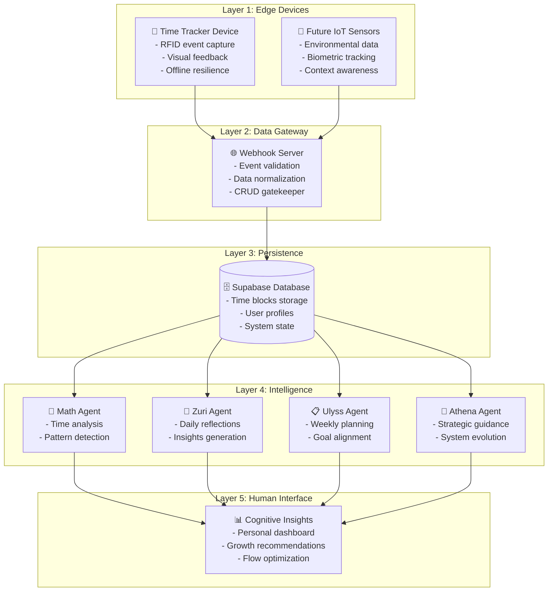

# Cognitive Wealth Ecosystem Overview

## 🎯 **Complete System Architecture**

The Time Tracker Device is **Layer 1** of a five-layer cognitive wealth ecosystem designed to transform passive time tracking into active cognitive development.

## 🏗️ **Matryoshka Architecture**



## 🔄 **Data Flow Patterns**

### **Edge → Gateway (fs_tool Pattern)**
```
Device Tools → Event Buffer → Webhook Tool → Server
     ↓
Local Storage ← ← ← Retry Logic ← ← ← Network Failure
```

**Key Insight:** Device `fs_tool` and webhook server follow **identical patterns** - both are data gatekeepers with CRUD permissions and retry logic.

### **Gateway → Intelligence (A2A Pattern)**
```
Webhook Server → Database → A2A Task Queue → Agents
      ↓              ↓            ↓           ↓
   Validation   Persistence  Coordination  Analysis
```

### **Intelligence → Human (Insight Synthesis)**
```
Multiple Agents → Memory Blocks → Insight Engine → Dashboard
       ↓              ↓              ↓           ↓
   Specialized    Knowledge      Synthesis   Action
   Analysis      Aggregation   Processing  Guidance
```

## 🎯 **Layer Responsibilities**

### **Layer 1: Edge Devices (This Repository)**
- **Physical interaction** with human workflow
- **Event capture** with high reliability
- **Offline resilience** and sync capabilities
- **Visual feedback** for user confidence
- **Flow awareness** (ultradian rhythm support)

### **Layer 2: Webhook Server**
- **Data validation** and normalization
- **Event routing** to appropriate storage
- **CRUD gatekeeper** for database
- **Retry handling** for failed operations
- **Security** and authentication

### **Layer 3: Database (Supabase)**
- **Persistent storage** of all events
- **User profile management**
- **System state tracking**
- **Query optimization** for agent access

### **Layer 4: AI Agents**
- **Math Agent:** Quantitative analysis, patterns, metrics
- **Zuri Agent:** Qualitative insights, daily reflections
- **Ulyss Agent:** Weekly planning, goal alignment
- **Athena Agent:** Strategic guidance, system evolution

### **Layer 5: Human Interface**
- **Personal dashboard** with cognitive insights
- **Growth recommendations** based on patterns
- **Flow optimization** suggestions
- **System feedback** for continuous improvement

## 🔗 **Integration Points**

### **Device → Server Interface**
```json
// Standard event format
{
  "event": "tag_placed",
  "tag_uid": "04B78FB0790000",
  "device_id": "ESP32_F0F5BD", 
  "timestamp": "2025-01-15T10:30:45Z",
  "internal_millis": 123456,
  "ntp_offset_ms": 1642234245000
}
```

### **Server → Database Interface**
- **Time blocks** table with normalized events
- **Device registry** for ecosystem management
- **User sessions** with calculated durations
- **System logs** for debugging and analytics

### **Database → Agents Interface**
- **A2A protocol** for task coordination
- **Memory blocks** with isotope decay
- **Template evolution** based on usage patterns
- **Feedback loops** for system improvement

## 🚀 **Ecosystem Benefits**

### **Scalability**
- **Add new devices** without changing server logic
- **Add new agents** without affecting existing analysis
- **Horizontal scaling** at each layer independently

### **Reliability** 
- **Offline-first** edge devices continue working
- **Retry mechanisms** at each integration point
- **Graceful degradation** when components fail

### **Intelligence Evolution**
- **Agent templates** evolve based on user patterns
- **System learns** optimal configurations automatically
- **Feedback loops** improve accuracy over time

### **Human-Centered Design**
- **Minimal friction** for data capture
- **Meaningful insights** not just raw data
- **Flow-respectful** notifications and guidance
- **Personal growth** focus over productivity optimization

## 🔮 **Future Expansion**

### **New Device Types**
- **Environmental sensors** (light, noise, air quality)
- **Biometric trackers** (heart rate, stress indicators)
- **Context sensors** (location, calendar integration)

### **Advanced Intelligence**
- **Cross-user pattern analysis** (anonymized)
- **Predictive modeling** for optimal work patterns
- **Personalized coaching** based on individual data

### **Integration Capabilities**
- **Calendar systems** for automatic context
- **Project management** tools for goal alignment
- **Health platforms** for holistic optimization

---

**Philosophy:** Technology that enhances human cognitive capacity while respecting natural rhythms and individual autonomy.
