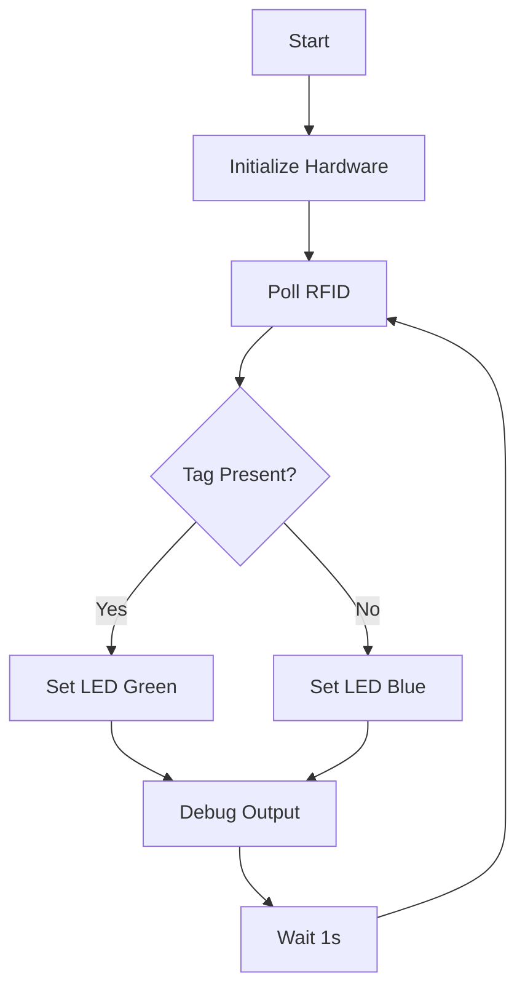
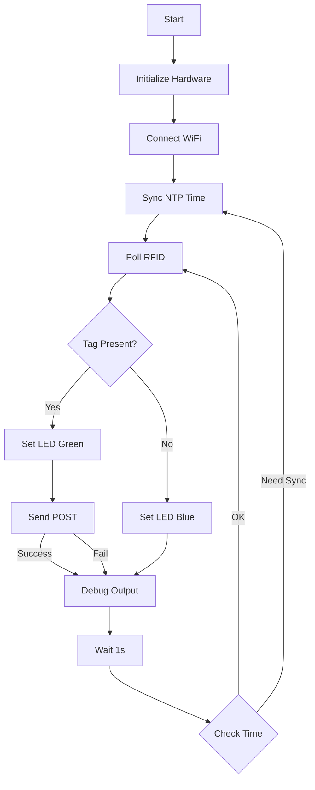
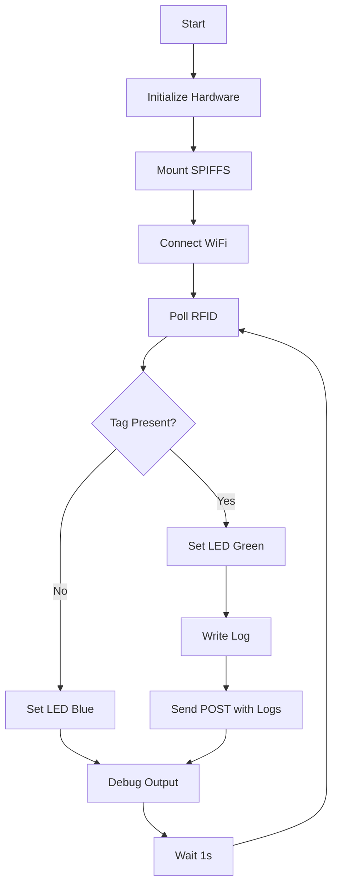
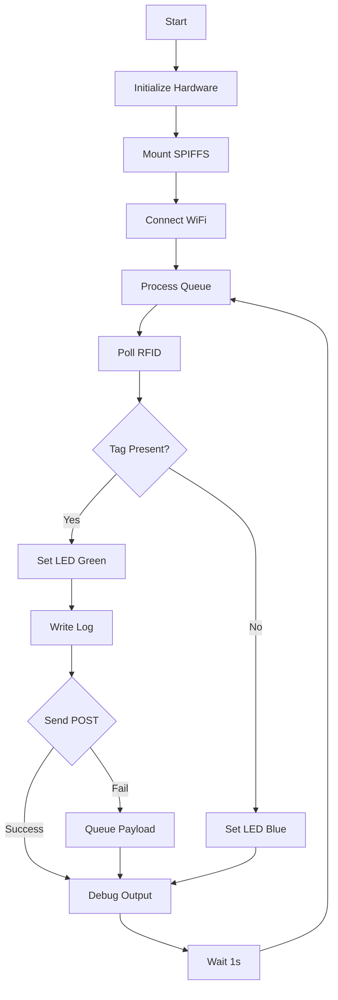

# Time Tracker Project Progress V3

## Core Design Principles

1. Progressive integration with validation between steps
2. Serial print monitoring for feedback and debug
3. Structured and documented code
4. Simple and reliable RFID detection

## Implementation Phases

### Phase 1: RFID Switch Foundation ✅

Starting point: Working RFID switch code from main.cpp



Core Functionality:

- [x] Basic RFID tag detection (success true/false)
- [x] LED feedback (blue=waiting, green=detected)
- [x] Serial debugging output
- [x] 1-second polling interval

Validation Checkpoints:

- [x] Consistent tag detection
- [x] Clear LED state indication
- [x] Proper serial output
- [x] Stable operation over time

Implementation Notes:

- Added tag type detection (Mifare Classic 4-byte, ISO14443-4 7-byte)
- Optimized I2C communication with recovery time
- Enhanced debug output with tag type information
- Improved timing control for stable readings

### Phase 2: WiFi Integration with NTP Time Sync



Building on validated RFID switch:

- [x] WiFi connection with multi-SSID support
- [x] Connection status via LED
- [x] NTP time synchronization
- [x] Basic webhook defined in credentials.h
- [x] Simple POST on tag detection

Validation Checkpoints:

- [x] WiFi connects reliably
- [x] LED shows connection status
- [x] NTP time syncs correctly
- [x] Timestamps in correct timezone
- [x] Webhook receives basic POST
- [x] System remains stable

Implementation Notes:

- Added WiFiManager class for modular WiFi handling
- Implemented NTP sync with timezone support (UTC+1 Brussels)
- Enhanced debug output with timestamps and sync status
- Visual feedback for time sync (purple LED flash)
- Added WebhookManager for handling POST requests
- Implemented JSON payload for RFID events (tag_insert/tag_removed)
- Created Supabase table structure for event logging

### Phase 3: Storage Implementation



After stable network operation:

- [ ] Initialize SPIFFS
- [ ] Create and manage log.csv
- [ ] Log tag events with timestamp
- [ ] Include logs in webhook payload for reference
- [ ] Implement log rotation based on entry count

Validation Checkpoints:

- [ ] SPIFFS mounts properly
- [ ] Logs written correctly
- [ ] File rotation works

Implementation Details:

1. **SPIFFS Manager Class (`spiffs_manager.h/cpp`)**

   ```cpp
   class SPIFFSManager {
       public:
           bool begin();
           bool writeLog(const LogEntry& entry);
           String readLogs(int count = -1);  // -1 for all logs
           bool clearLogs();
           int getLogEntryCount();
           bool rotateLogIfNeeded();
   };
   ```

2. **Log Entry Structure**

   ```cpp
   struct LogEntry {
       String timestamp;
       String event_type;
       bool tag_present;
       String tag_id;
       String tag_type;
       String wifi_status;
       String time_status;
       String webhook_status;
   };
   ```

3. **Log Rotation Strategy**
   - Set maximum number of entries (e.g., 1000) instead of file size
   - When limit reached:
     - Create backup of current log as `log_backup.csv`
     - Start fresh log file
     - Delete oldest backup if space needed

4. **Integration Points**
   - Mount SPIFFS in setup()
   - Add log writing in main loop after webhook call
   - Add log status to debug output

### Phase 4: Enhanced Communication



Once storage is validated:

- [ ] Improved webhook payload structure
- [ ] Failed payload queueing with exponential backoff
- [ ] Automatic retry on reconnection
- [ ] Enhanced LED patterns for status
- [ ] Memory optimization and heap monitoring

Validation Checkpoints:

- [ ] Payloads sent successfully
- [ ] Queue system works
- [ ] Retries function properly
- [ ] LED patterns are clear
- [ ] Memory usage remains stable

Implementation Details:

1. **Enhanced WiFi Resilience**
   - Add connection state machine in WiFiManager
   - Implement exponential backoff for reconnection attempts
   - Cache DNS resolution
   - Add WiFi signal strength monitoring

2. **Webhook Queue System**

   ```cpp
   struct QueuedWebhook {
       String payload;
       unsigned long timestamp;
       int retryCount;
   };
   ```

   - Store failed webhooks in SPIFFS queue
   - Implement retry mechanism with backoff
   - Process queue on WiFi reconnection

3. **Backoff Strategy**

   ```cpp
   unsigned long getBackoffDelay(int retryCount) {
       // Exponential backoff: 5s, 10s, 20s, 40s, 80s
       return 5000 * (1 << retryCount);  // 2^retryCount * 5000ms
   }
   ```

   - Prevents overwhelming the server/network
   - Saves power/resources
   - More likely to succeed after waiting

4. **Heap Monitoring**

   ```cpp
   void checkHeapHealth() {
       size_t freeHeap = ESP.getFreeHeap();
       if (freeHeap < HEAP_WARNING_THRESHOLD) {
           // Log warning
           // Trigger LED warning pattern
       }
   }
   ```

   - Tracks ESP32's dynamic memory usage
   - Prevents crashes from memory exhaustion
   - Provides early warning of memory leaks

5. **LED Status Patterns**
   - Add patterns for:
     - Queue processing (yellow pulse)
     - SPIFFS errors (red rapid blink)
     - Webhook retrying (purple pulse)
     - Low memory warning (orange blink)

## Current Status

Phase 2 completed ✅, moving to Phase 3:

✅ Completed:

- Implemented reliable RFID detection (Phase 1)
- Added WiFiManager with multi-SSID support
- Integrated NTP time synchronization
- Enhanced debug output with timestamps
- Validated WiFi connection and time sync
- Implemented webhook functionality with JSON payload
- Created Supabase database structure
- Validated webhook POST requests for tag events

🔄 Next Phase (Storage Implementation):

- Initialize SPIFFS
- Implement SPIFFSManager class
- Create log entry structure
- Implement log rotation based on entry count
- Enhance webhook payload with log data

Next steps:

1. Create `spiffs_manager.h` and `spiffs_manager.cpp`
2. Define LogEntry structure
3. Implement SPIFFS initialization in setup()
4. Add log writing after webhook calls
5. Implement log rotation based on entry count
